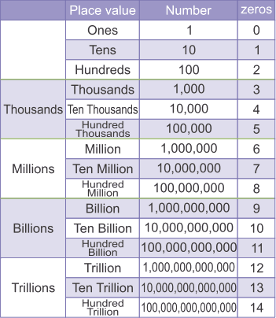

# Cardinal Numerals


A [cardinal numeral](<https://en.wikipedia.org/wiki/Cardinal_number_(linguistics)>) is a noun used to count, such as the Vietnamese words **một**, **hai**, **ba**, but also compounds, such as **ba trăm bốn mươi hai**.

Create a file `cardinal_numeral.py` where you will write in all the functions of this mission.

# Waypoint 1: Generate Vietnamese Numerals

Write a function `integer_to_vietnamese_numeral` that takes an argument `n` representing a positive integer, and returns a string corresponding to the **North** [Vietnamese cardinal numeral](https://en.wikipedia.org/wiki/Vietnamese_numerals) of this number.

The function raises the exception `TypeError` if the argument `n` is not an integer.

The function raises the exception `ValueError` if the argument `n` is not positive integer.

The maximum integer the function can generate a cardinal numeral is `999,999,999,999`. If `n` is over this number, the function raises the exception `OverflowError`.

For example:

```python
>>> integer_to_vietnamese_numeral(96)
'chín mươi sáu'
>>> integer_to_vietnamese_numeral(405)
'bốn trăm linh năm'
>>> integer_to_vietnamese_numeral(1915)
'một nghìn chín trăm mười lăm'
>>> integer_to_vietnamese_numeral(5061)
'năm nghìn không trăm sáu mươi mốt'
>>> integer_to_vietnamese_numeral(1002003)
'một triệu không trăm linh hai nghìn không trăm linh ba'
>>> integer_to_vietnamese_numeral(1000000)
'một triệu'
>>> integer_to_vietnamese_numeral(1030000)
'một triệu không trăm ba mươi nghìn'
>>> integer_to_vietnamese_numeral(1002003)
'một triệu không trăm linh hai nghìn không trăm linh ba'
>>> integer_to_vietnamese_numeral(1002003004)
'một tỷ không trăm linh hai triệu không trăm linh ba nghìn không trăm linh bốn'
>>> integer_to_vietnamese_numeral(1002003004)
'một tỷ không trăm linh ba nghìn không trăm linh bốn'
>>> integer_to_vietnamese_numeral(1002000004)
'một tỷ không trăm linh hai triệu không trăm linh bốn'
>>> integer_to_vietnamese_numeral(100000004)
'một trăm triệu không trăm linh bốn'
>>> integer_to_vietnamese_numeral(999999999999)
'chín trăm chín mươi chín tỷ chín trăm chín mươi chín triệu chín trăm chín mươi chín nghìn chín trăm chín mươi chín'
>>> integer_to_vietnamese_numberal('9999999999990')
Traceback (most recent call last):
  File "<input>", line 1, in <module>
  File "<input>", line 4, in _integer_to_vietnamese_numeral
Overflow: Integer greater than 999,999,999,999
>>> integer_to_vietnamese_numberal('4096')
Traceback (most recent call last):
  File "<input>", line 1, in <module>
  File "<input>", line 3, in _integer_to_vietnamese_numeral
TypeError: Not an integer
>>> integer_to_vietnamese_numeral(-1)
Traceback (most recent call last):
  File "<input>", line 1, in <module>
  File "<input>", line 6, in _integer_to_vietnamese_numeral
ValueError: Not a positive integer
```

_Hint: if you have not a clear idea how to start, you should consider revising the [international system of numeration](https://www.youtube.com/watch?v=jKo_NrYcAaA), which is followed by most of the countries of the world, including Vietnam. In this system, a number is split up into groups (periods). There is a pattern that repeats for each group._



# Waypoint 2: Support Vietnamese Southern Numerals

The words "nghìn" and "linh" are the standard reading in Northern Vietnam, whilst "ngàn" and "lẻ" are more commonly used in the South.

Add an [optional argument](http://www.yourownlinux.com/2016/12/python-function-keyword-defaults-optional-arguments.html) `region` (a string) to the function `integer_to_vietnamese_numeral` that can be passed with one of the two possible values (strings):

- `'north'`: Northern Vietnam
- `'south'`: Southern Vietnam

By default, the parameter `region` is set to `north`. If the argument `region` is passed to the function `integer_to_vietnamese_numeral` with the value `None`, it defaults to `north`.

If the argument `region` passed to the function is not `None` and is not a string, the function `integer_to_vietnamese_numeral` raises an exception `TypeError`.

If the argument `region` passed to the function is not `None` and is not one of the two values `'north'` and `'south'`, the function `integer_to_vietnamese_numeral` raises an exception `ValueError`.

For examples:

```python
>>> integer_to_vietnamese_numeral(405)
'bốn trăm linh năm'
>>> integer_to_vietnamese_numeral(405, region='south')
'bốn trăm lẻ năm'
>>> integer_to_vietnamese_numeral(1971, region='north')
'một nghìn chín trăm bảy mươi một'
>>> integer_to_vietnamese_numeral(1971, region='south')
'một ngàn chín trăm bảy mươi một'
>>> integer_to_vietnamese_numeral(1, region=0)
Traceback (most recent call last):
  File "<input>", line 1, in <module>
  File "<input>", line 3, in _integer_to_vietnamese_numeral
TypeError: Argument "region" is not a string
>>> integer_to_vietnamese_numeral(1, region='whatever')
Traceback (most recent call last):
  File "<input>", line 1, in <module>
  File "<input>", line 6, in _integer_to_vietnamese_numeral
ValueError: Argument "region" has not a correct value
```

# Waypoint 3: Say Vietnamese Numerals

We would like our function `integer_to_vietnamese_numeral` to say the Vietnamese numeral that the function generates from the argument `n`. This is called [text-to-speech (TTS)](https://en.wikipedia.org/wiki/Speech_synthesis). Text-to-speech is [commonly used nowadays on mobile phones](https://www.youtube.com/watch?v=-gTn4Q-9Lk8).

Our implementation of the generation of synthesized speech from Vietnamese numerals will be simple. The function `integer_to_vietnamese_numeral` will successively play the sound of each Vietnamese numeral that the function has generated from the argument `n`.

The directory `./sounds/vie/north` contains several sound files corresponding to each Vietnamese numeral:

```bash
$ ls -la ./sounds/vie/north
total 152
drwxr-xr-x  21 dcaune  staff   672 Jun 24 10:25 .
drwxr-xr-x   5 dcaune  staff   160 May 27 08:52 ..
-rw-r--r--@  1 dcaune  staff  2496 Jun 24 08:52 ba.mp3
-rw-r--r--@  1 dcaune  staff  2784 Jun 24 08:54 bảy.mp3
-rw-r--r--@  1 dcaune  staff  2784 Jun 24 08:53 bốn.mp3
-rw-r--r--@  1 dcaune  staff  2880 Jun 24 08:55 chín.mp3
-rw-r--r--@  1 dcaune  staff  2880 Jun 24 08:52 hai.mp3
-rw-r--r--@  1 dcaune  staff  2688 Jun 24 10:24 không.mp3
-rw-r--r--@  1 dcaune  staff  2304 Jun 24 08:54 lăm.mp3
-rw-r--r--@  1 dcaune  staff  2112 Jun 24 08:52 mốt.mp3
-rw-r--r--@  1 dcaune  staff  2016 Jun 24 08:51 một.mp3
-rw-r--r--@  1 dcaune  staff  2976 Jun 24 08:56 mươi.mp3
-rw-r--r--@  1 dcaune  staff  2976 Jun 24 08:56 mười.mp3
-rw-r--r--@  1 dcaune  staff  2304 Jun 24 08:53 năm.mp3
-rw-r--r--@  1 dcaune  staff  2592 Jun 24 08:57 ngàn.mp3
-rw-r--r--@  1 dcaune  staff  2400 Jun 24 08:57 nghìn.mp3
-rw-r--r--@  1 dcaune  staff  3264 Jun 24 08:54 sáu.mp3
-rw-r--r--@  1 dcaune  staff  2592 Jun 24 08:55 tám.mp3
-rw-r--r--@  1 dcaune  staff  2496 Jun 24 08:57 trăm.mp3
-rw-r--r--@  1 dcaune  staff  2688 Jun 24 08:58 triệu.mp3
-rw-r--r--@  1 dcaune  staff  2208 Jun 24 08:58 tỷ.mp3
```

For example, the Vietnamese numeral for `128` is "một trăm hai mươi tám". If we pass the argument `n` with the value `128`, the function `integer_to_vietnamese_numeral` needs to play the following sound files in that order:

1. `một.mp3`
1. `trăm.mp3`
1. `hai.mp3`
1. `mươi.mp3`
1. `tám.mp3`

Update the function `integer_to_vietnamese_numeral` by adding an optional argument `activate_tts` (a boolean), with the default value `False`.

If the argument `activacte_tts` is passed with the value `None`, it defaults to `False`.

When this argument `activate_tts` is `True`, the function says the Vietnamese numeral that the function generates from the argument `n`, and it returns the Vietnamese numeral. If this argument `activate_tts` is `True`, the function only returns the Vietnamese numeral without saying it.

If the argument `activate_tts` passed to the function is not `None` and it is not a boolean value, the function `integer_to_vietnamese_numeral` raises an exception `TypeError`.

For example:

```python
>>> integer_to_vietnamese_numeral(405, activate_tts=True)
'bốn trăm linh năm'
>>> integer_to_vietnamese_numeral(405, region='south', activate_tts=True)
'bốn trăm lẻ năm'
>>> integer_to_vietnamese_numeral(1971, activate_tts=True, region='north')
'một nghìn chín trăm bảy mươi một'
>>> integer_to_vietnamese_numeral(1971, region='south', activate_tts=True)
'một ngàn chín trăm bảy mươi một'
>>> integer_to_vietnamese_numeral(1, activate_tts=1)
Traceback (most recent call last):
  File "<input>", line 1, in <module>
  File "<input>", line 3, in _integer_to_vietnamese_numeral
TypeError: Argument "activate_tts" is not a boolean
```

# Waypoint 4: Say Vietnamese Numerals with Southern Accent

The sound files contained in the directory `./sounds/vie` correspond to Vietnamese numerals said with the Northern accent. We would like to support Vietnamese Southern accent.

If the argument `region` is `'north'`, then the function `integer_to_vietnamese_numeral` says the numeral with the North accent, but if the argument `region` is `'south'`, then the function says the numeral with the South accent.

Unfortunately, we don't have sound files for Vietnamese Southern pronunciation of Vietnamese numerals. You need to create these audio files by recording yourself. You probably have an Android or a iPhone mobile phone. You will easily find a free voice recorder application on your favorite online store.

# Waypoint 5: Generate English Numerals

Write a function `integer_to_english_numeral` that takes an argument `n` representing a positive integer, and returns a string corresponding to the [English cardinal numeral](https://en.wikipedia.org/wiki/English_numerals) of this number.

The function raises the exception `TypeError` if the argument `n` is not an integer.

The function raises the exception `ValueError` if the argument `n` is not positive integer.

For example:

```python
>>> integer_to_english_numeral(96)
'ninety-six'
>>> integer_to_english_numeral(101)
'one hundred and one'
>>> integer_to_english_numeral(405)
'four hundred and five'
>>> integer_to_english_numeral(1971)
'one thousand and nine hundred and seventy-one'
>>> integer_to_english_numeral(5061)
'five thousand and sixty-one'
>>> integer_to_english_numberal('4096')
Traceback (most recent call last):
  File "<input>", line 1, in <module>
  File "<input>", line 3, in _integer_to_english_numeral
TypeError: Not an integer
>>> integer_to_english_numeral(-1)
Traceback (most recent call last):
  File "<input>", line 1, in <module>
  File "<input>", line 6, in _integer_to_english_numeral
ValueError: Not a positive integer
```

_Note: You can check whether your function `integer_to_english_numeral` returns the correct English cardinal numeral by comparing this result with [online generators](https://www.ego4u.com/en/cram-up/vocabulary/numbers/generator)._

# Waypoint 6: Say English Numerals

We would also want our function `integer_to_english_numeral` to say the English numeral that the function generates from the argument `n`! 😁

Update the function `integer_to_english_numeral` by adding an optional argument `activate_tts` (a boolean), with the default value `False`. If the argument`activate_tts`is passed with the value`None`, it defaults to`False`.

When this argument `activate_tts` is `True`, the function says the English numeral generated from the argument `n`, and the function returns the English numeral. If this argument `activate_tts` is `True`, the function only returns the English numeral without saying it.

If the argument `activate_tts` passed to the function is not `None` and it is not a boolean value, the function raises an exception `TypeError`.

Where are the audio files for the English cardinal numerals? Guess what, you will also have to record these audio files yourself and save them in the directory `./sounds/eng`... Like a pro! 😈😎
